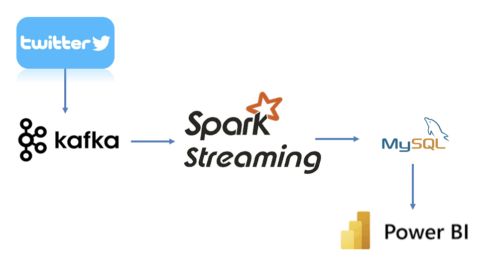
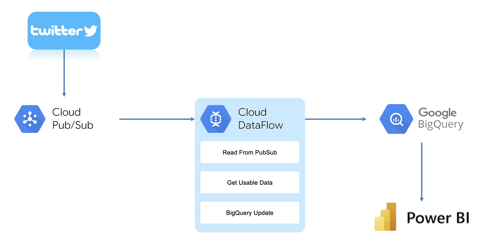
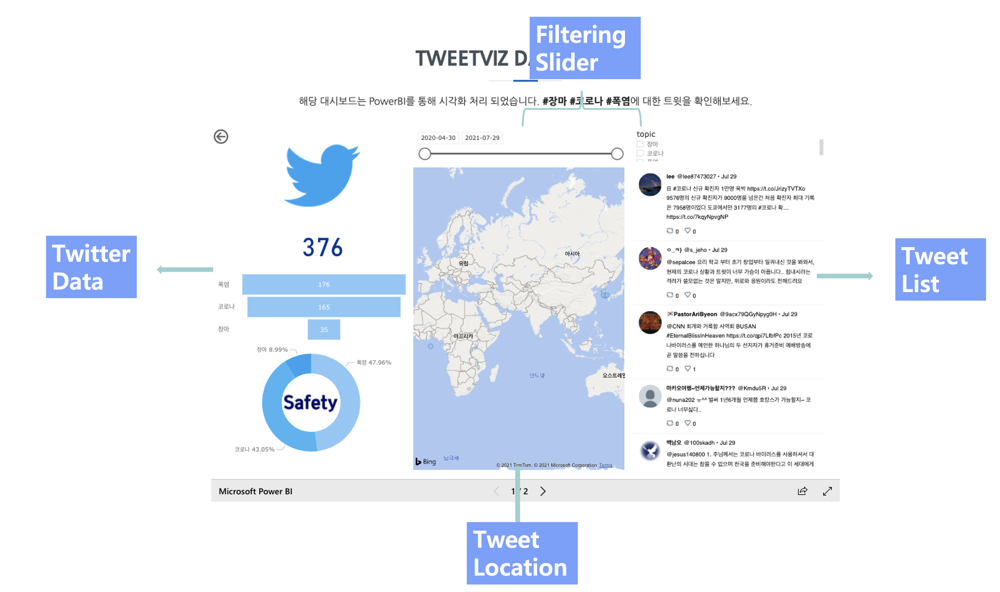
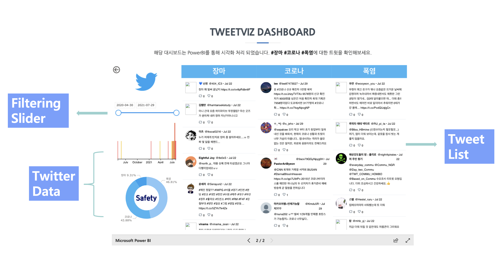

# Tweet data pipeline Project
트위터에서 제공하는 트윗 데이터를 수집하고 실시간으로 처리하여 위치 기반 시각화와 워드 클라우드, 키워드 별 트윗 스레드를 제공하는 실시간 트윗 시각화 서비스입니다. 

# Architecture

<On-premise>

로컬 환경에 <kbd>Kafka</kbd>, <kbd>Spark</kbd>, <kbd>Jupyter Notebook</kbd>, <kbd>Zookeeper</kbd>, <kbd>MySQL</kbd>를 설치하여 만든 파이프라인입니다. 키워드를 포함하는 트윗을 실시간으로 받아 카테고리 별로 다른 <kbd>Kafka</kbd> topic에 프로듀싱합니다. <kbd>Spark Streaming</kbd>에서 <kbd>Kafka</kbd> topic에 저장된 데이터를 가져가 불용어를 제거하는 처리 후 <kbd>MySQL</kbd>에 저장합니다. 최종적인 테이블 데이터셋을 <kbd>PowerBI</kbd>에서 읽어 실시간 대시보드를 보여줍니다.

<Cloud>

<kbd>GCP</kbd>에서 제공하는 서비스를 사용한 파이프라인입니다. <kbd>Kafa</kbd>를 대신하여 데이터 스트림 서비스 <kbd>Cloud Pub/Sub</kbd>을 사용했고, <kbd>DataFlow</kbd>에서 전처리 후 <kbd>BigQuery</kbd>에 전송했습니다. 시각화 툴은 <kbd>PowerBI</kbd>을 동일하게 사용했습니다.

 # Dashboard Form
 

메인 토픽 및 토픽 기간을 정할 수 있는 Filtering Slider, 해당 트윗의 위치를 찍어주는 Tweet Location, 트위터의 전체적인 정보를 보여주는 Twitter data 그리고 메인 토픽의 트윗글을 보여주는 Tweet List로 구성된 대시보드입니다.

 
 
 토픽별 트윗 결과를 함께 보여줍니다. 이와 함께 트윗의 기간을 정할 수 있는 Filtering Slider와 Twitter Data 부분도 첫 번째 대시보드와 동일하게 보여줍니다.# TwitterLiveMaps

 
 

# Pipeline using Docker container

2022년 8월 8일 서울 홍수주의보가 발령되고 역대 최악의 홍수와 범람으로 많은 재신 및 인명피해가 발생했습니다. 이때 트위터를 중심으로 사람들 사이에서 지역별 피해 및 상황 정보가 빠르게 공유되어 퇴근길 인구에게 많은 도움이 되었습니다. 해당 프로젝트는 홍수, 범람, 지하철 연착 등의 정보를 대시보드 형태로 제공하는 파이프라인으로, 현 상황에 적합하다고 파악해 컨테이너 환경에서 프로젝트를 디벨롭합니다.

# Architecture

기존 구조를 그대로 가져갑니다. 